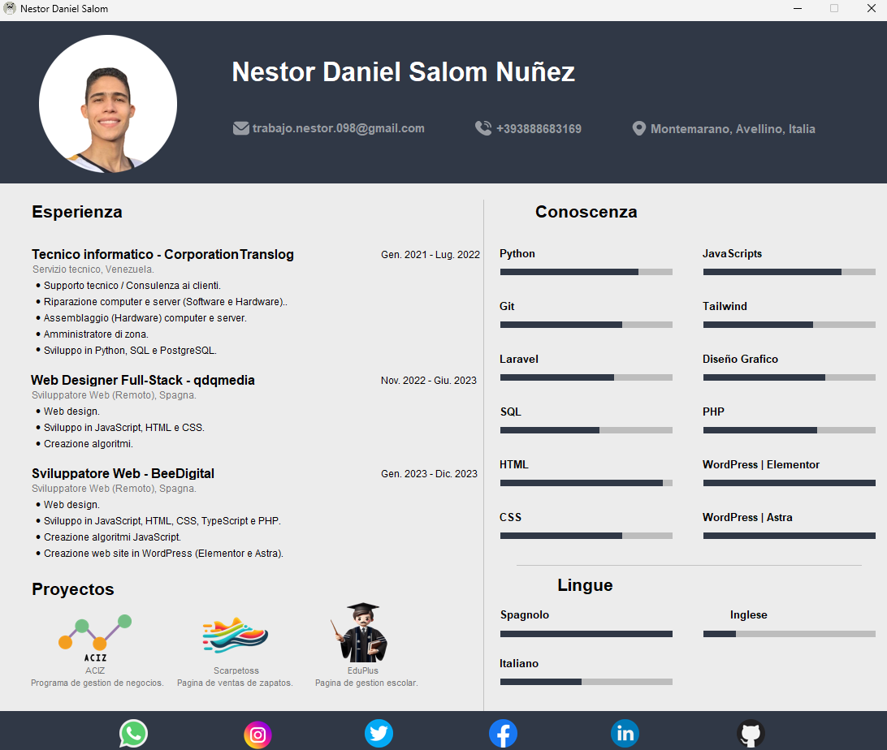

# CV Personal

Esta es una aplicación de CV personal desarrollada en Python utilizando la biblioteca Tkinter. La aplicación permite a los usuarios visualizar un currículum vitae con información personal, experiencia laboral y habilidades.

## Captura de pantalla

<p align="center">
  
</p>

## Características

- Interfaz gráfica de usuario sencilla y fácil de usar.
- Visualización de información personal, educación, experiencia laboral y habilidades.
- Navegación intuitiva a través de las diferentes secciones del CV.
- Copiado de información al portapapeles.
- Apertura de enlaces web.

## Requisitos

- Python 3.x
- Tkinter (incluido en la biblioteca estándar de Python)
- PIL (Pillow)
- pyperclip

## Instalación

1. Clona este repositorio en tu máquina local:

```sh
git clone https://github.com/tu_usuario/cv-personal.git
cd cv-personal